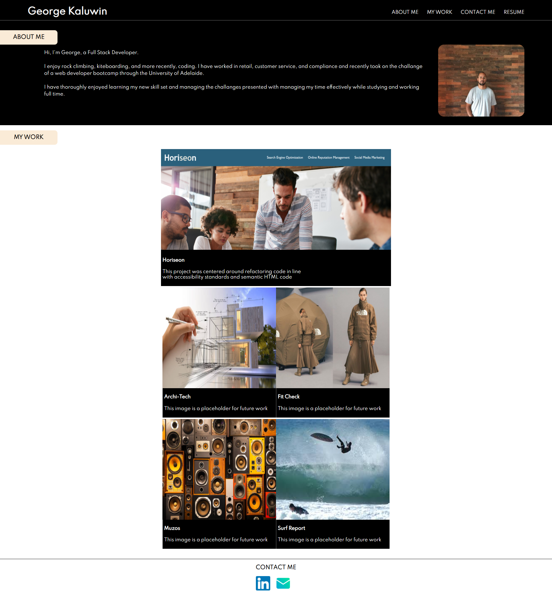

# My-Portfolio
The purpose of this project was to create my own portfolio as a Web Developer.

I wanted to create a portfolio that I was proud of and that satisfied the criteria outlined by the project

When you open up my portfolio you will find:

- My name in the header and a navigation bar that allows you smoothly to scroll through the sections of the page or open my resume.
- A small About me section, Images of my projects which if clicked, will take you to the deployed applications(Most of these are simply placeholders at the moment).
- A responsive design which can be viewed across large and small screens.

Below you will find an image of my portfolio and a link to the deployed application.

Portfolio link: https://gkal14.github.io/my-portfolio/

